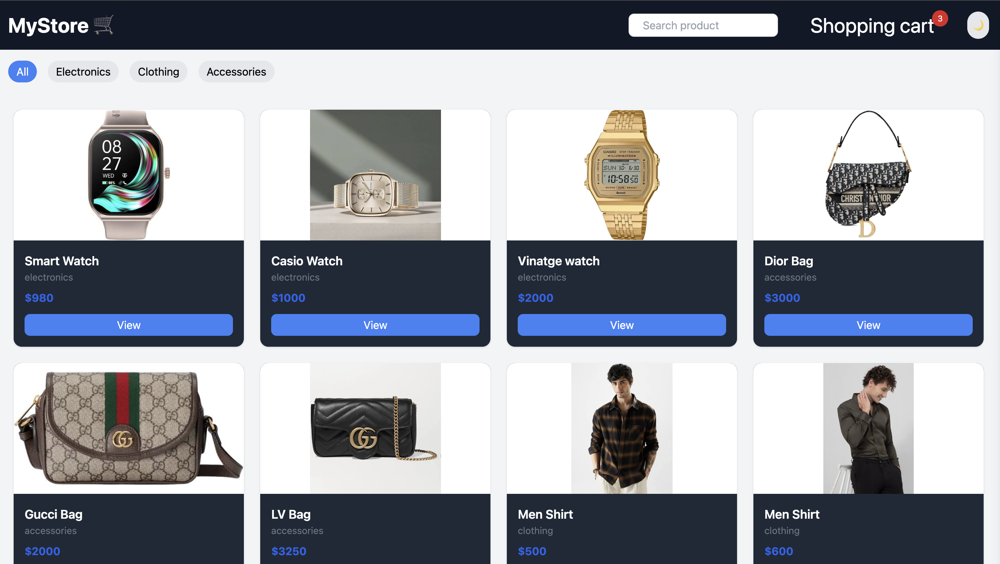
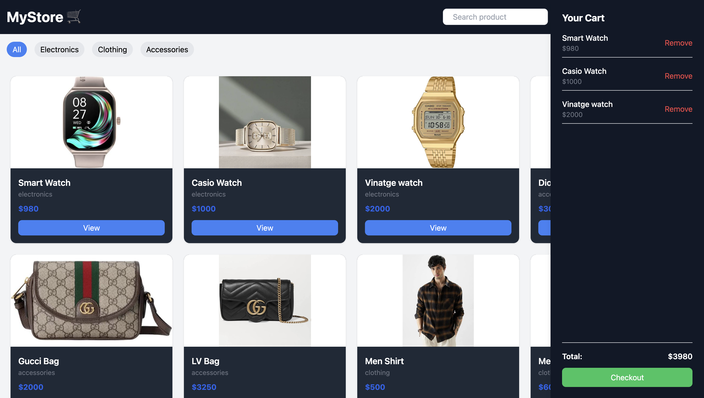

# 🛒 MyStore - E-commerce Project

A simple e-commerce website built using **HTML, Tailwind CSS, and JavaScript**.  
Users can browse products, view details, add items to the shopping cart, and check out with a responsive UI.

---

## 🚀 Features
- 🛍️ Browse products by categories (Electronics, Clothing, Accessories)  
- ➕ Add / ➖ Remove products from the cart  
- 💰 View total cart price in real-time  
- 📱 Responsive design with Tailwind CSS  

---

## 📸 Screenshots

### 🛍️ Product Listing


### 🛒 Shopping Cart


---

## 🛠️ Tech Stack
- **HTML** – for structure  
- **Tailwind CSS** – for styling and responsive design  
- **JavaScript** – for interactivity (cart logic, product handling)

---

## ⚙️ Setup & Run Locally
Clone the repository and open the project in your browser:

```bash
git clone https://github.com/YasmeenShk/ecommerce-store.git
cd ecommerce-store
